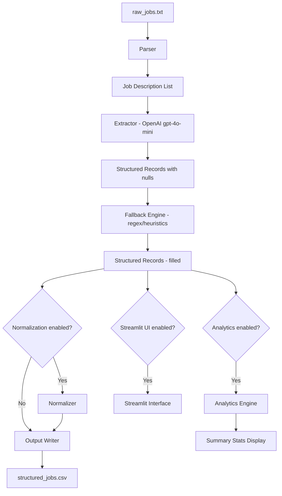

# Design Document: Job Description Parser Pipeline

## Overview

The job-description-parser-pipeline is a Python batch processing system that reads unstructured job description text from a delimited file, extracts structured fields using the OpenAI API with regex/heuristic fallbacks, and writes a clean CSV dataset. The pipeline is designed for single-run batch processing of 20+ job descriptions.

The system is composed of five discrete components: Parser, Extractor, Fallback Engine, Normalizer (optional), and Output Writer. Each component has a single responsibility and communicates via plain Python data structures (lists and dicts), making the pipeline easy to test and extend.

## Architecture



The pipeline runs top-to-bottom in a single Python process. Optional components (Normalizer, Analytics, Streamlit UI) are gated by configuration flags. The core pipeline (Parser → Extractor → Fallback → Output) is always executed.

## Components and Interfaces

### Parser

Reads `data/raw_jobs.txt` (UTF-8), splits on `===JOB===`, strips whitespace, and discards empty blocks.

```python
def parse_input_file(file_path: str) -> list[str]:
    """
    Returns a list of non-empty job description strings.
    Raises FileNotFoundError if the file does not exist.
    Raises ValueError if no non-empty job descriptions are found.
    """
```

### Extractor

Calls the OpenAI ChatCompletion API for each job description and returns a `StructuredRecord`.

```python
def extract_fields(job_description: str, index: int) -> StructuredRecord:
    """
    Calls gpt-4o-mini with a system prompt requesting JSON output.
    On API error or JSON parse failure: logs the error and returns a null record.
    """
```

System prompt instructs the model to return exactly:
```json
{"role": "...", "skills": [...], "seniority": "...", "location": "...", "salary": "..."}
```

### Fallback Engine

Applied after extraction to fill null `salary` and `location` fields using regex and heuristics.

```python
def apply_fallbacks(record: StructuredRecord, raw_text: str) -> StructuredRecord:
    """
    Applies salary regex and location heuristics only when the respective field is null.
    Never overwrites non-null values.
    Returns a new StructuredRecord with fallback values applied.
    """
```

Salary regex pattern: `\d+\s?-\s?\d+\s?(LPA|k|K)`

Location heuristics: match against a curated list of known city/country names plus keywords `Remote` and `Hybrid`.

### Normalizer (Optional)

Maps skill aliases to canonical names using a configurable dictionary.

```python
def normalize_skills(
    record: StructuredRecord,
    alias_map: dict[str, str]
) -> StructuredRecord:
    """
    Case-insensitive alias lookup. Deduplicates after mapping.
    Preserves skills not found in the alias map unchanged.
    """
```

### Output Writer

Writes the dataset to `data/structured_jobs.csv` using pandas.

```python
def write_csv(records: list[StructuredRecord], output_path: str) -> None:
    """
    Creates the output directory if it does not exist.
    Serializes skills lists as JSON array strings.
    Writes null fields as empty cells.
    Column order: role, skills, seniority, location, salary.
    """
```

### Pipeline Orchestrator

```python
def run_pipeline(config: PipelineConfig) -> list[StructuredRecord]:
    """
    Orchestrates Parser → Extractor → Fallback → (Normalizer) → Output Writer.
    Logs total processed, successful, and failed extraction counts.
    Continues processing on per-record failures.
    """
```

### Analytics Engine (Optional)

```python
def compute_analytics(records: list[StructuredRecord]) -> AnalyticsSummary:
    """
    Computes top-10 skills, role frequency, and salary stats (min/max/median).
    Handles the case where no parseable numeric salary exists.
    """
```

### Streamlit UI (Optional)

A thin wrapper around `run_pipeline` that replaces the file path input with a file uploader widget and renders the dataset as an interactive table with a CSV download button.

## Data Models

```python
from dataclasses import dataclass, field
from typing import Optional

SENIORITY_LEVELS = {"Junior", "Mid", "Senior", "Lead"}

@dataclass
class StructuredRecord:
    role: Optional[str] = None
    skills: list[str] = field(default_factory=list)
    seniority: Optional[str] = None   # must be one of SENIORITY_LEVELS or None
    location: Optional[str] = None
    salary: Optional[str] = None

@dataclass
class PipelineConfig:
    input_path: str = "data/raw_jobs.txt"
    output_path: str = "data/structured_jobs.csv"
    openai_model: str = "gpt-4o-mini"
    enable_normalization: bool = False
    skill_alias_map: dict[str, str] = field(default_factory=dict)
    enable_analytics: bool = False
    enable_streamlit: bool = False

@dataclass
class AnalyticsSummary:
    top_skills: list[tuple[str, int]]          # (skill, count), top 10
    role_frequency: list[tuple[str, int]]       # (role, count), sorted desc
    salary_min: Optional[float] = None
    salary_max: Optional[float] = None
    salary_median: Optional[float] = None
    salary_insufficient: bool = False
```

### Field Validation Rules

| Field | Type | Valid Values |
|---|---|---|
| `role` | `str \| None` | Any string or null |
| `skills` | `list[str]` | List of strings (may be empty) |
| `seniority` | `str \| None` | `Junior`, `Mid`, `Senior`, `Lead`, or null |
| `location` | `str \| None` | Any string or null |
| `salary` | `str \| None` | Any string or null |


## Correctness Properties

*A property is a characteristic or behavior that should hold true across all valid executions of a system — essentially, a formal statement about what the system should do. Properties serve as the bridge between human-readable specifications and machine-verifiable correctness guarantees.*

**Property Reflection:** After reviewing all testable criteria, the following consolidations were made:
- 1.2 and 1.6 are combined into a single round-trip property (parsing joined text recovers the original list).
- 3.1/3.2/3.3 are combined into one salary fallback property (covers match and no-match cases via generator).
- 3.4/3.5/3.6 are combined into one location fallback property.
- 4.1 and 4.2 are the same one-to-one mapping invariant — merged.
- 4.1 and 4.3 are combined: the batch-size invariant holds even when individual records fail.
- 5.2 and 5.3 are combined into one CSV schema property.
- 6.1/6.2/6.3 are combined into one normalization property (case-insensitive replacement + preservation).

---

### Property 1: Parser round-trip

*For any* list of one or more non-empty, non-whitespace job description strings, joining them with the `===JOB===` delimiter and then parsing the result should produce a list equal to the original input list.

**Validates: Requirements 1.2, 1.6**

---

### Property 2: Whitespace blocks are discarded

*For any* input string that contains whitespace-only blocks between delimiters, the parser output should contain no strings that are empty or composed entirely of whitespace.

**Validates: Requirements 1.3**

---

### Property 3: Extraction preserves all five keys

*For any* mocked API response that is valid JSON containing the five required keys (`role`, `skills`, `seniority`, `location`, `salary`), the extractor should return a `StructuredRecord` where every field is populated (non-null) and `skills` is a `list[str]`.

**Validates: Requirements 2.3, 2.4**

---

### Property 4: Invalid seniority is nulled

*For any* seniority string that is not one of `Junior`, `Mid`, `Senior`, `Lead`, the extractor should replace it with `None` in the resulting `StructuredRecord`.

**Validates: Requirements 2.5**

---

### Property 5: Salary fallback extracts or preserves null

*For any* raw job description text and a `StructuredRecord` with a null `salary` field, applying the fallback engine should set `salary` to the first substring matching `\d+\s?-\s?\d+\s?(LPA|k|K)` if one exists, or leave it as `None` if no match is found.

**Validates: Requirements 3.1, 3.2, 3.3**

---

### Property 6: Location fallback extracts or preserves null

*For any* raw job description text and a `StructuredRecord` with a null `location` field, applying the fallback engine should set `location` to a matched location keyword if one is present in the text, or leave it as `None` if no match is found.

**Validates: Requirements 3.4, 3.5, 3.6**

---

### Property 7: Fallback never overwrites non-null fields

*For any* `StructuredRecord` where `salary` or `location` is already non-null, applying the fallback engine (regardless of the raw text content) should leave those fields unchanged.

**Validates: Requirements 3.7**

---

### Property 8: Batch size invariant

*For any* list of N job descriptions, the pipeline should produce exactly N `StructuredRecord` outputs — even when some individual extractions fail (failed records become all-null records rather than being dropped).

**Validates: Requirements 4.1, 4.2, 4.3**

---

### Property 9: CSV schema invariant

*For any* list of `StructuredRecord` objects written to CSV, the resulting file should have exactly the columns `role`, `skills`, `seniority`, `location`, `salary` in that order, and exactly as many data rows as there are records.

**Validates: Requirements 5.2, 5.3**

---

### Property 10: Skills serialization round-trip

*For any* `StructuredRecord` with a non-empty `skills` list, writing it to CSV and then reading back the `skills` cell and parsing it as JSON should produce a list equal to the original `skills` list.

**Validates: Requirements 5.4**

---

### Property 11: Normalization replaces matching aliases

*For any* `StructuredRecord` and alias map, after normalization every skill that matches a key in the alias map (case-insensitively) should be replaced with the canonical value, every non-matching skill should be preserved unchanged, and the resulting list should contain no duplicate canonical skills.

**Validates: Requirements 6.1, 6.2, 6.3, 6.4**

---

### Property 12: Analytics top-skills are actually most frequent

*For any* dataset of `StructuredRecord` objects, the top-10 skills returned by the analytics engine should be the 10 skills with the highest occurrence counts across all records (or fewer than 10 if the dataset has fewer unique skills).

**Validates: Requirements 8.1**

---

### Property 13: Role frequency is sorted descending

*For any* dataset of `StructuredRecord` objects, the `role_frequency` list returned by the analytics engine should be sorted in non-increasing order of count.

**Validates: Requirements 8.2**

---

### Property 14: Salary stats invariant

*For any* dataset containing at least one parseable numeric salary, the analytics engine should produce `salary_min <= salary_median <= salary_max`.

**Validates: Requirements 8.3**

---

## Error Handling

| Scenario | Component | Behavior |
|---|---|---|
| Input file not found | Parser | Raise `FileNotFoundError` with the missing path in the message |
| Input file empty / no valid blocks | Parser | Raise `ValueError` with a descriptive message |
| OpenAI API HTTP error | Extractor | Log error with HTTP status and job index; return all-null `StructuredRecord` |
| API response is not valid JSON | Extractor | Log descriptive error with job index; return all-null `StructuredRecord` |
| API response missing required keys | Extractor | Log warning; set missing keys to `None` |
| Output directory does not exist | Output Writer | Create directory with `os.makedirs(exist_ok=True)` before writing |
| No parseable numeric salary for analytics | Analytics Engine | Set `salary_insufficient=True`; do not raise |
| Streamlit upload error | Streamlit UI | Display inline error message; do not crash |

All per-record errors are non-fatal: the pipeline logs the failure and continues to the next record. Only file-level errors (missing/empty input) abort the run.

## Testing Strategy

### Framework and Libraries

- **Unit/property tests**: `pytest` with `hypothesis` for property-based testing (Python)
- **Mocking**: `unittest.mock` / `pytest-mock` for OpenAI API calls
- **CSV assertions**: `pandas` for reading back output files in tests

### Property-Based Tests

Each property test uses `hypothesis` with `@given` decorators and runs a minimum of 100 iterations. Each test is tagged with a comment referencing the design property.

```python
# Feature: job-description-parser-pipeline, Property 1: Parser round-trip
@given(st.lists(st.text(min_size=1).filter(lambda s: s.strip()), min_size=1))
def test_parser_round_trip(job_descriptions):
    joined = "===JOB===".join(job_descriptions)
    result = parse_input_file_from_string(joined)
    assert result == [jd.strip() for jd in job_descriptions]
```

Properties to implement as property-based tests:
- Property 1: Parser round-trip (hypothesis `st.lists(st.text(...))`)
- Property 2: Whitespace blocks discarded (hypothesis generates whitespace-only blocks)
- Property 3: Extraction preserves all five keys (hypothesis generates valid JSON dicts)
- Property 4: Invalid seniority is nulled (hypothesis generates arbitrary strings)
- Property 5: Salary fallback extracts or preserves null (hypothesis generates texts with/without salary patterns)
- Property 6: Location fallback extracts or preserves null
- Property 7: Fallback never overwrites non-null fields
- Property 8: Batch size invariant (hypothesis generates lists of job descriptions)
- Property 9: CSV schema invariant (hypothesis generates lists of StructuredRecords)
- Property 10: Skills serialization round-trip
- Property 11: Normalization replaces matching aliases
- Property 12: Analytics top-skills are most frequent
- Property 13: Role frequency sorted descending
- Property 14: Salary stats invariant

### Unit / Example-Based Tests

- Parser raises `FileNotFoundError` for missing file (Req 1.4)
- Parser raises `ValueError` for empty file (Req 1.5)
- Extractor calls API with model `gpt-4o-mini` (Req 2.1)
- Extractor system prompt contains all five required keys (Req 2.2)
- Extractor returns all-null record on HTTP error (Req 2.7)
- Extractor returns all-null record on invalid JSON (Req 2.8)
- Pipeline logs correct counts on completion (Req 4.4)
- Output writer creates missing directory (Req 5.6)
- Null fields written as empty CSV cells (Req 5.5)
- Analytics returns `salary_insufficient=True` when no numeric salary (Req 8.4)

### Integration Tests

- End-to-end run with a small sample `raw_jobs.txt` and mocked OpenAI responses, verifying the output CSV is correct.
- Streamlit UI: manual smoke test for file upload, table display, and download button.
